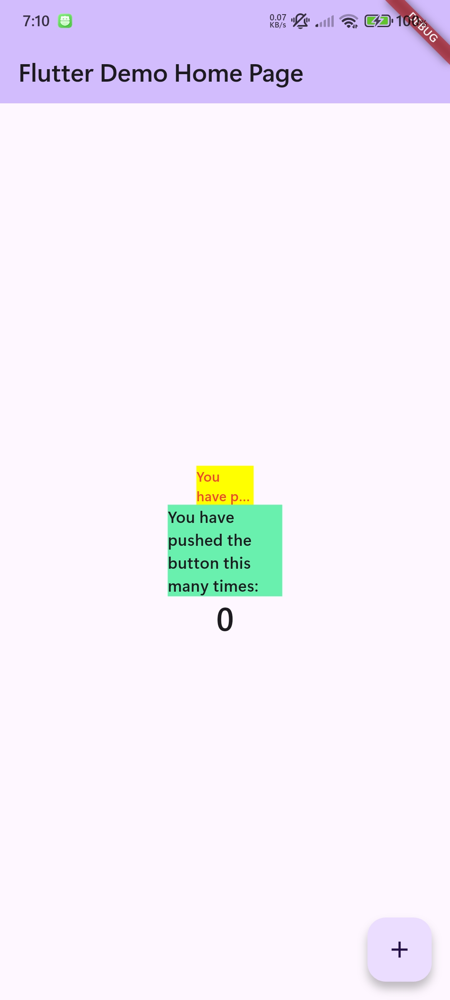

# flutter_application_4

A new Flutter project.

Create a flutter_plugin_pubdev project and add the auto_size_text plugin. Create a RedTextWidget widget with a text parameter that displays red text using AutoSizeText, then display it in main.dart along with an example of regular text.

